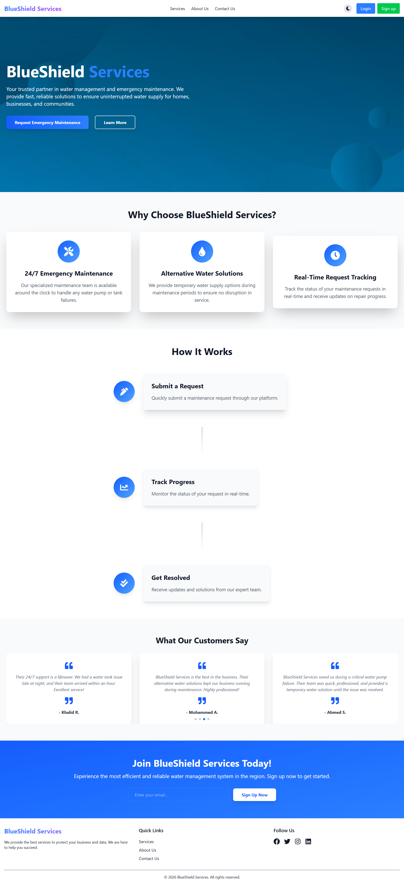
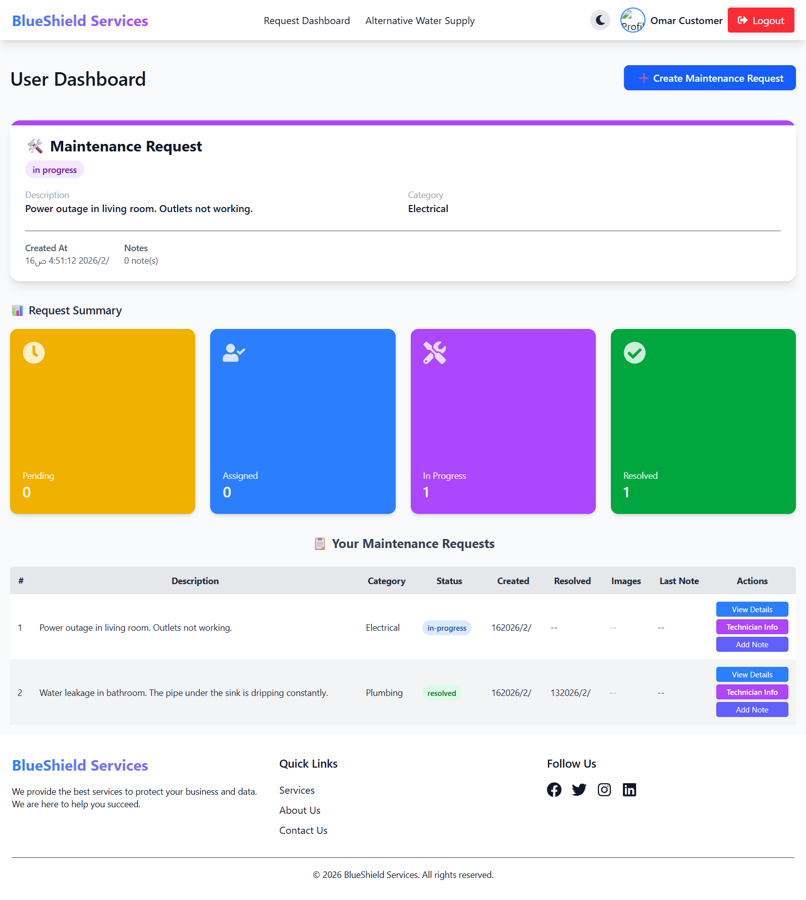
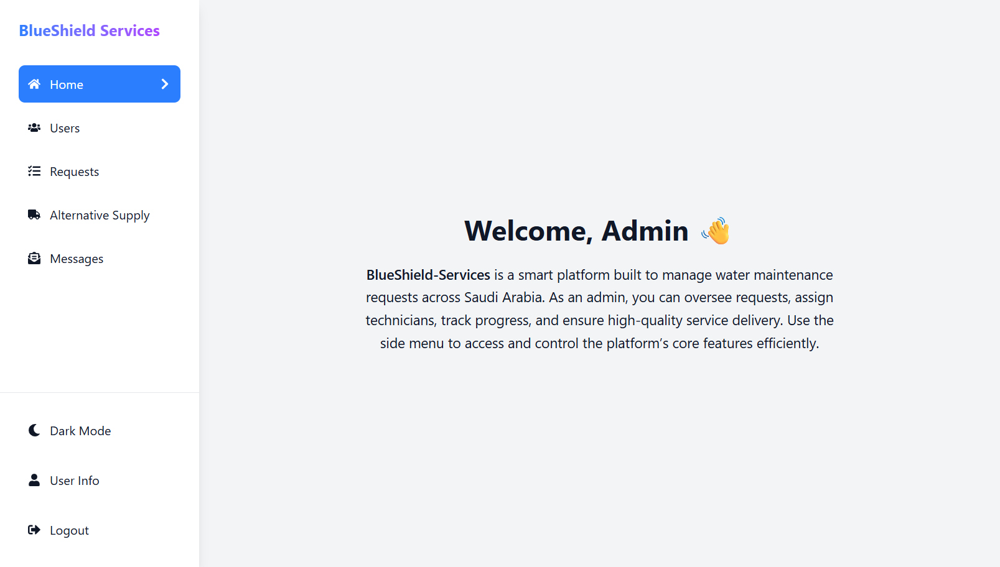

# BlueShield Services - Water Maintenance Management Platform

## Project Overview

**BlueShield Services** is a comprehensive web-based platform designed to streamline water maintenance operations and emergency response services. This project represents the initial version developed as a proposal for a water maintenance company operating in Saudi Arabia. 

> **Important Note:** This version is a demonstration prototype showcased in my professional portfolio. The actual deployed version for the client differs significantly from this showcase version, as it has been further developed with additional features and customizations specific to the client's operational requirements.

---

## Project Context and Purpose

In many residential and commercial areas across Saudi Arabia, water infrastructure maintenance presents significant challenges. When water pump failures occur or water supply interruptions happen, residents and businesses often struggle to find immediate assistance. BlueShield Services was conceptualized to bridge this gap by creating a digital platform that connects service seekers with maintenance professionals efficiently.

The platform serves multiple stakeholder groups:
- **Residential users** experiencing water-related emergencies
- **Commercial establishments** requiring prompt maintenance services
- **Educational institutions** and healthcare facilities with critical water needs
- **Government facilities** seeking reliable maintenance partnerships
- **Maintenance technicians** looking for organized work assignments
- **Service administrators** managing operations and quality assurance

---

## Core Objectives

### 1. Emergency Response Management
The platform provides 24/7 access to emergency maintenance services, ensuring that water pump failures and critical infrastructure issues receive immediate attention. Users can submit urgent requests at any time, which are then routed to available qualified technicians.

### 2. Alternative Water Supply Coordination
During service interruptions or major repairs, the platform facilitates the provision of alternative water supplies. This ensures that homes, businesses, and essential facilities maintain uninterrupted access to water resources while permanent solutions are being implemented.

### 3. Transparency and Accountability
Through real-time request tracking and status updates, all parties involved maintain complete visibility into the maintenance process. This transparency builds trust and allows for better planning and communication.

### 4. Operational Efficiency
By digitizing the entire request and assignment workflow, the platform reduces response times, minimizes administrative overhead, and optimizes resource allocation across the maintenance team.

---

## Platform Features

### Public Interface

*The landing page presents the platform's value proposition and guides visitors through available services*

The public-facing website serves as the primary introduction to BlueShield Services. Visitors can explore:

- **Service Information**: Detailed explanations of available maintenance services and emergency response capabilities
- **How It Works**: Step-by-step guidance on submitting requests and tracking progress
- **Company Background**: Information about the organization's mission, values, and service commitment
- **Contact Capabilities**: Direct communication channels for inquiries and initial consultations
- **User Registration**: Seamless account creation process for new service seekers
- **Authentication**: Secure login system for existing users

The interface emphasizes clarity and ease of use, recognizing that many users may be accessing the platform during stressful situations requiring urgent assistance.

### User Dashboard Experience

*Users access a comprehensive dashboard for managing maintenance requests and tracking service progress*

Registered users gain access to a personalized dashboard that serves as their central hub for all maintenance-related activities:

#### Request Management
- **Create Maintenance Requests**: Users describe their water-related issues, categorize the problem type, and provide specific location information
- **Image Documentation**: The ability to upload photographs helps technicians understand the situation before arrival
- **Location Specification**: Interactive map integration allows precise location marking for accurate service dispatch
- **Request History**: Complete visibility into all past and current requests with detailed status information

#### Status Tracking
The platform provides real-time updates on request progression through various stages:
- **Pending**: Request received and awaiting assignment
- **Assigned**: Technician designated and preparing to respond
- **In Progress**: Active work underway at the location
- **Resolved**: Issue successfully addressed and service completed

#### Alternative Water Supply
When extended maintenance work is required, users can request temporary water supply services:
- Specify delivery location and requirements
- Choose payment method (cash on delivery or electronic payment)
- Track delivery status from request to completion
- View assigned delivery personnel information

#### Communication Features
- Add notes and comments to requests for better communication with technicians
- View responses and updates from the maintenance team
- Access technician contact information for direct coordination

### Administrative Control Center

*Administrators oversee all platform operations through a comprehensive management interface*

The administrative interface provides complete oversight and control over platform operations:

#### User Management
Administrators maintain full control over the user ecosystem:
- View all registered users with role designations (regular users, technicians, administrators)
- Create new user accounts and assign appropriate access levels
- Modify user information and update profile details
- Monitor user activity and engagement patterns
- Generate user statistics based on demographics, locations, and usage patterns

#### Request Oversight
The administrative team manages all incoming maintenance requests:
- **Request Dashboard**: Centralized view of all requests across all statuses
- **Filtering Capabilities**: Sort and filter requests by status, category, date, or location
- **Detailed Request View**: Access complete information including user details, problem description, images, and location
- **Status Management**: Update request statuses as work progresses
- **Technician Assignment**: Designate appropriate technicians based on expertise and availability
- **Resolution Tracking**: Record completion times and maintain service history

#### Analytics and Reporting
The platform generates valuable insights into service operations:
- Request volume trends over time
- Average resolution times by category
- Technician performance metrics
- Popular service categories and common issues
- Geographic distribution of service requests
- Export capabilities for detailed Excel reports

#### Alternative Supply Management
Administrators coordinate alternative water supply services:
- Review and prioritize supply requests
- Assign delivery personnel
- Track payment methods and financial aspects
- Monitor delivery completion and user satisfaction
- Maintain inventory and resource planning

#### Communication Management
The contact message system allows administrators to:
- Review messages submitted through the contact form
- Mark messages as read or unread for organization
- Reply to inquiries directly through the platform
- Add internal administrative notes for coordination
- Filter messages by status (replied, unreplied, search by content)
- Delete obsolete or resolved communications

---

## User Experience Design Philosophy

### Accessibility and Simplicity
The platform was designed with the understanding that users may access it during emergencies or stressful situations. Therefore, every interface element prioritizes clarity and ease of use over complexity. Navigation paths are intuitive, and critical actions are prominently displayed.

### Visual Clarity
Color coding throughout the interface helps users quickly understand status at a glance:
- Yellow/Orange indicators for pending items
- Blue for assigned and active processes
- Purple for ongoing work
- Green for completed and resolved items

This visual language reduces cognitive load and allows users to quickly assess situations without reading detailed text.

### Responsive Design
Recognizing that users may access the platform from various devices - desktop computers, tablets, or mobile phones - the interface adapts seamlessly to different screen sizes. This ensures that emergency requests can be submitted from wherever the user is located.

### Dark Mode Support
An integrated dark mode toggle provides visual comfort for users accessing the platform in different lighting conditions, reducing eye strain during extended use or nighttime access.

---

## Operational Workflow

### Standard Maintenance Request Flow

1. **Request Submission**: A user identifies a water-related issue and submits a detailed request through their dashboard, including description, category, images, and location

2. **Administrative Review**: The request appears immediately in the administrative dashboard, where staff review the details and assess urgency

3. **Technician Assignment**: Based on expertise, availability, and geographic proximity, an appropriate technician is assigned to the request

4. **Status Updates**: As the technician prepares and travels to the location, status updates keep the user informed

5. **On-Site Service**: The technician performs necessary maintenance work, potentially adding notes or updates through the system

6. **Resolution**: Upon completion, the request is marked as resolved, and the system records the resolution time for reporting purposes

7. **Historical Record**: The completed request remains in the system as part of the user's service history and the company's operational records

### Alternative Water Supply Process

1. **Supply Request**: User submits a request for alternative water delivery, specifying location and payment preference

2. **Request Processing**: Administrative staff review the request and coordinate with supply logistics

3. **Delivery Assignment**: A delivery technician is assigned with route and timing information

4. **Delivery Execution**: The water supply is transported to the specified location

5. **Confirmation**: Upon successful delivery, the request is marked complete, and any payment processing is finalized

---

## Security and Privacy Considerations

The platform implements robust security measures to protect user information and maintain operational integrity:

- **Authentication**: Secure login system with encrypted password storage
- **Authorization**: Role-based access control ensures users only access appropriate features
- **Session Management**: Automatic logout after periods of inactivity prevents unauthorized access
- **Data Protection**: User personal information and location data are handled with strict privacy protocols

---

## Scalability and Future Potential

While this version represents an initial prototype, the platform architecture supports significant expansion:

- **Geographic Expansion**: The system can accommodate operations across multiple cities and regions
- **Service Diversification**: Additional maintenance categories can be integrated beyond water services
- **Integration Capabilities**: The platform can connect with external systems for payments, SMS notifications, and mapping services
- **Analytics Enhancement**: More sophisticated reporting and predictive maintenance features can be developed
- **Mobile Applications**: Native mobile apps can be developed using the existing backend infrastructure

---

## Technical Architecture Overview

The platform follows a modern web application architecture with clear separation between frontend and backend systems:

### Frontend Layer
The user interface is built with contemporary web technologies, providing responsive and interactive experiences across all devices. The interface communicates with the backend through secure API endpoints.

### Backend Layer
The server-side infrastructure handles:
- Request processing and business logic
- Database operations and data persistence
- File storage and image management
- Authentication and authorization
- Report generation and data export

### Database Layer
A document-based database stores all platform information including user profiles, maintenance requests, supply orders, and messaging data. The flexible schema accommodates various data structures while maintaining consistency.

---

## Project Development Timeline

This demonstration version was developed as part of a portfolio of professional projects. The development process included:

1. **Requirements Analysis**: Understanding the water maintenance industry needs and user pain points
2. **System Design**: Architecting the platform structure and defining user roles
3. **Interface Design**: Creating intuitive user experiences for different stakeholder groups
4. **Implementation**: Building the frontend and backend systems
5. **Integration**: Connecting all components and implementing data flow
6. **Testing**: Ensuring functionality across different scenarios and user types

---

## Professional Portfolio Context

This project demonstrates capabilities in:
- **Full-stack web development**: Building complete applications from frontend to backend
- **User experience design**: Creating intuitive interfaces for diverse user groups
- **Business process digitization**: Translating real-world operational needs into digital solutions
- **Role-based systems**: Implementing sophisticated access control and user management
- **Data visualization**: Presenting complex information through dashboards and reports

---

## Conclusion

BlueShield Services represents a comprehensive solution to water maintenance management challenges in the Saudi Arabian market. By providing 24/7 emergency response capabilities, alternative water supply coordination, and transparent operational tracking, the platform addresses critical needs for both service seekers and maintenance providers.

This demonstration version showcases the foundational capabilities of the platform while maintaining flexibility for customization and expansion based on specific client requirements. The actual deployed version incorporates additional features and modifications tailored to the operational needs of the maintenance company.

The project exemplifies how digital platforms can transform traditional service industries, improving efficiency, transparency, and customer satisfaction while supporting business growth and operational excellence.

---

## Contact and Further Information

For inquiries about this project, technical discussions, or professional collaboration opportunities, please refer to the contact information provided in my professional portfolio.

---

**Copyright © 2026 BlueShield Services. All rights reserved.**

*This documentation describes a portfolio demonstration project. The actual deployed system may contain different features and configurations.*
